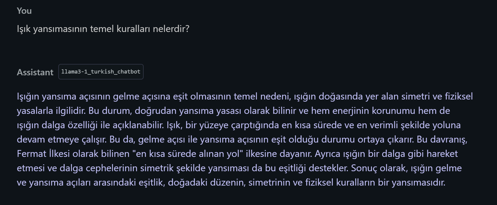

# Llama3.1 Turkish Educational ChatBot - Metehan Ayhan

[EN]

## About the Project

This project is a fine-tuned version of the **Meta LLaMA 3.1 8B** large language model, specifically adapted to respond to **Turkish educational question-answer** prompts. The main goal is to deliver fluent, informative, and context-aware answers in Turkish, suitable for general inquiry and learning support.

The model was fine-tuned using the **LoRA** technique on a small scale (1% of trainable parameters) and published on Hugging Face:

🔗 [metehanayhan/Llama3-1_Turkish_ChatBot](https://huggingface.co/metehanayhan/Llama3-1_Turkish_ChatBot)

---

## Training Summary

| Feature | Value |
| --- | --- |
| Base Model | Meta LLaMA 3.1 8B |
| Fine-Tuning Method | Supervised Fine-Tuning (SFT) |
| LoRA Usage | Yes (%1 of model trained) |
| Training Data | Turkish question–answer pairs |
| Number of Training Samples | 17,587 |
| Epochs | 1 |
| Total Training Steps | 2,199 |
| Learning Rate | 2e-5 |
| Total Batch Size | 8 |
| Training Duration (approx.) | ~3 hours |
| Trainable Parameters | 83M / 8B (1.05%) |
| Quantization | 4-bit |

---

## Data Format

The dataset consists of Turkish question–answer pairs provided in CSV format. Each row represents a complete educational sample.

Example:

```
question,answer
What can be done to prevent climate change?,
"To combat climate change, actions like reducing fossil fuel usage and transitioning to renewable energy sources are essential..."
```

A total of 17,587 such examples were used for fine-tuning.

---

## Use Case

This model is intended to serve as an educational assistant in Turkish. It can answer questions related to:

- Informative, general-knowledge, or school-related topics
- Support for curious learners and students

---

## Quick Start

```python
from transformers import AutoTokenizer, AutoModelForCausalLM, pipeline

tokenizer = AutoTokenizer.from_pretrained("metehanayhan/Llama3-1_Turkish_ChatBot")
model = AutoModelForCausalLM.from_pretrained("metehanayhan/Llama3-1_Turkish_ChatBot")

qa_pipe = pipeline("text-generation", model=model, tokenizer=tokenizer)
print(qa_pipe("İklim değişikliği neden önemlidir?", max_new_tokens=200)[0]["generated_text"])
```

---

## Performance Notes

The model performs well on Turkish QA-style prompts that resemble the training distribution:

- 🔸 Fluent and natural Turkish sentence construction
- 🔸 Answers are contextually aligned with the prompt

The model shows strong generalization, even with limited training, due to the LoRA technique and high-quality data.

<p align="center">
  
</p>


---

## Deployment

The model is shared on Hugging Face with 4-bit quantization and is ready for low-resource inference. It has also been exported in GGUF format for use in compatible environments.

---

## Additional Notes

- The training was performed using `Trainer` with standard SFT configuration.
- `random_state = 3407` was used to ensure reproducibility.
- Although fine-tuned on just 1% of parameters, the model responds effectively across a wide range of Turkish topics.

---

[TR]

# Llama3.1 Türkçe Eğitim Odaklı ChatBot

## Proje Hakkında

Bu model, **Meta LLaMA 3.1 8B** tabanlı büyük bir dil modelidir ve Türkçe dilinde, eğitim odaklı **soru-cevap (QA)** verisiyle fine-tune edilmiştir. Amaç, kullanıcıların bilgi arayışına doğal, akıcı ve anlamlı yanıtlar sunabilen bir yardımcı oluşturmaktır.

Model, %1 oranında LoRA yöntemiyle optimize edilmiş ve Hugging Face platformuna aktarılmıştır:

🔗 [metehanayhan/Llama3-1_Turkish_ChatBot](https://huggingface.co/metehanayhan/Llama3-1_Turkish_ChatBot)

---

## Eğitim Özeti

| Özellik | Değer |
| --- | --- |
| Temel Model | Meta LLaMA 3.1 8B |
| Eğitim Yöntemi | Supervised Fine-Tuning (SFT) |
| İnce Ayar Tekniği | LoRA |
| Eğitim Verisi | Türkçe Eğitim Q/A |
| Eğitim Örneği Sayısı | 17,587 |
| Eğitim Epoch’u | 1 |
| Toplam Eğitim Adımı (steps) | 2,199 |
| Öğrenme Oranı | 2e-5 |
| Toplam Batch Size | 8 |
| Eğitim Süresi (yaklaşık) | 3 saat |
| Eğitilen Parametre Oranı | %1 (83M / 8B) |
| Quantization | 4-bit |

---

## Veri Formatı

Veri kümesi, her satırı bir soru-cevap çifti olan Türkçe bir CSV dosyasından oluşmaktadır. Örnek:

```
soru,cevap
İklim değişikliğine karşı neler yapılabilir?,
"İklim değişikliğiyle mücadele için fosil yakıt kullanımının azaltılması, yenilenebilir enerjiye geçiş gibi önlemler alınabilir..."
```

Toplam 17,587 satır veriyle eğitim gerçekleştirilmiştir.

---

## Amaç ve Kullanım Alanı

Model, aşağıdaki türde sorulara doğal dilde bilgi sunmak amacıyla geliştirilmiştir:

- Açıklayıcı, öğretici, genel kültür soruları
- Öğrencilerin veya meraklı bireylerin bilgi edinme taleplerine destek
- Cevap üretimi sırasında özgün, tutarlı ve doğal Türkçe dil kullanımı

---

## Hızlı Başlangıç

```python
from transformers import AutoTokenizer, AutoModelForCausalLM, pipeline

tokenizer = AutoTokenizer.from_pretrained("metehanayhan/Llama3-1_Turkish_ChatBot")
model = AutoModelForCausalLM.from_pretrained("metehanayhan/Llama3-1_Turkish_ChatBot")

qa_pipe = pipeline("text-generation", model=model, tokenizer=tokenizer)
print(qa_pipe("İklim değişikliği neden önemlidir?", max_new_tokens=1024)[0]["generated_text"])
```

---

## Performans

Model, eğitim verisine benzer sorularda oldukça doğal, akıcı ve içerik açısından doyurucu cevaplar üretmektedir. LoRA yöntemi sayesinde düşük hesaplama kaynağı ile etkili bir öğrenme gerçekleştirilmiştir. Eğitim sırasında gözlemlenen bazı bulgular:

- 🔸 Cevaplar Türkçe dil yapısına uygun
- 🔸 Soruyla bağlamsal olarak ilişkili

<p align="center">
  
</p>


---

## Yayınlama

Model, Hugging Face üzerinde quantize edilmiş biçimde (4-bit) paylaşılmıştır ve inference için kullanıma hazırdır. GGUF biçimiyle de dışa aktarılmıştır.

---

## Notlar

- Eğitim random_state=3407 ile tekrarlanabilirlik için sabitlenmiştir.
- Eğitim süreci `Trainer` altyapısıyla gerçekleştirilmiş ve standart veri ön işleme yapılmıştır.
- Model, küçük eğitimle geniş bilgi alanlarında doğal cevaplar üretme yeteneğine sahiptir.

---
